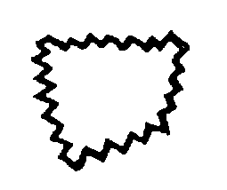
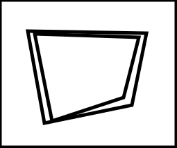
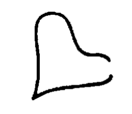
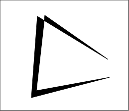
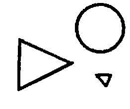
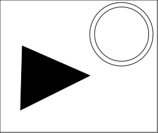

# Bongard2SVG

A Python tool for converting Bongard Problem box images to SVG format, with intelligent shape detection and vectorization.

## Features

- Converts PNG images to clean SVG vector graphics
- Intelligent shape detection:
  - Automatically detects circles and triangles
  - Distinguishes between lines and filled shapes
  - Handles nested shapes correctly
- Maintains visual fidelity:
  - Preserves line thickness
  - Correctly handles filled vs outlined shapes
  - Maintains original image dimensions
- Batch processing support for multiple files

## Examples

### Line and Shape Examples
Here are some examples of the conversion results:

| Input PNG | Output SVG | Description |
|:---:|:---:|:---|
|  |  | Simple line drawing |
|  |  | Mixed shapes |
|  |  | Complex pattern |

The converter intelligently:
- Detects and preserves line drawings without filling
- Identifies and maintains filled shapes
- Handles complex patterns with mixed elements

## Dependencies

```bash
pip install pillow numpy svgwrite pypotrace
brew install potrace  # For macOS
```

## Usage

1. Place your PNG images in a `boxes` directory
2. Run the converter:
```python
python image_to_svg.py
```

The script will process all PNG files in the `boxes` directory and create corresponding SVG files.

## How it Works

The converter uses several sophisticated algorithms:

1. **Shape Analysis**
   - Area/perimeter ratio analysis for line detection
   - Radius variance calculation for circle detection
   - Triangle detection using corner analysis
   - Nested shape detection to avoid double tracing

2. **Fill Detection**
   - Black pixel ratio analysis
   - Size-based thresholds:
     - Small objects (< 500px²): 90% black required
     - Large objects: 85% black required
   - Special handling for geometric shapes

3. **Path Generation**
   - Bezier curve preservation
   - Automatic path closure handling
   - Stroke width adjustment based on shape type

## Parameters

Key parameters that affect the conversion:

```python
# Size thresholds
MIN_AREA = 100  # Minimum area to process
SMALL_OBJECT_THRESHOLD = 500  # Threshold for strict fill criteria
SHAPE_DETECTION_THRESHOLD = 1000  # Threshold for shape detection

# Fill criteria
SMALL_OBJECT_FILL_RATIO = 0.9  # Black pixel ratio for small objects
LARGE_OBJECT_FILL_RATIO = 0.85  # Black pixel ratio for large objects

# Line detection
AREA_PERIMETER_RATIO = 5  # Threshold for line detection
```

## Contributing

Feel free to submit issues and enhancement requests!

## License

GPL 3.0